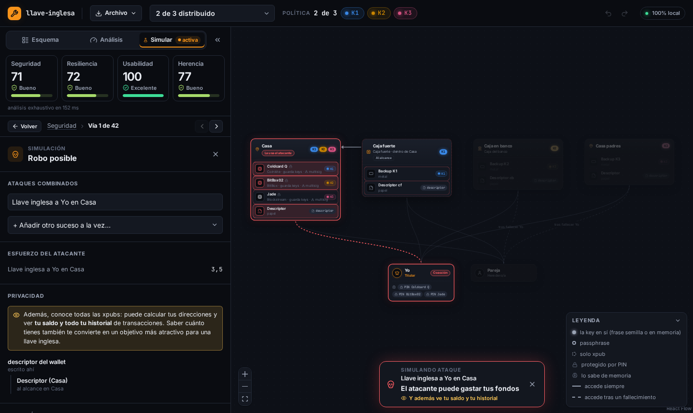

<p align="center">
  <picture>
    <source media="(prefers-color-scheme: dark)" srcset="docs/img/logo-oscuro.svg">
    
  </picture>
</p>

# llave-inglesa

**Pon a prueba la custodia de tus bitcoins antes de que lo haga otro.**

llave-inglesa es un simulador de esquemas de custodia Bitcoin (single-sig, passphrase, multisig).
Describes qué keys, dispositivos y backups tienes, dónde están y quién sabe qué, y la herramienta
calcula:

- **Seguridad**: las formas más baratas de robarte (una intrusión, una llave inglesa, una cuenta
  en la nube hackeada, un RNG con fallo…) y cuánto esfuerzo le cuesta al atacante.
- **Resiliencia**: qué desgracias, solas o combinadas, te dejarían sin fondos (un incendio,
  perder una placa, olvidar la passphrase…) y cuán probables son.
- **Usabilidad**: a cuántos sitios tienes que ir para firmar de forma segura.
- **Herencia**: si tus herederos llegarían a los fondos y qué podría impedirlo.

Cada resultado explica **por qué**, y cualquier combinación se puede **simular en el mapa**.



## Privacidad y seguridad

- **Nunca escribas frases semilla, claves privadas ni passphrases reales: no hacen falta.** El
  modelo solo describe *qué* existe, *dónde* está y *quién* lo sabe.
- **Sin red**: la aplicación no puede hacer ninguna petición (política de seguridad del contenido
  con `connect-src 'none'`). Sin cuentas, sin telemetría, sin CDNs; las fuentes van incluidas.
- Aun sin secretos, tu esquema es un **mapa del tesoro**. Por eso se guarda **cifrado**: en el
  navegador o en un fichero `.llave`, con AES-256-GCM y una clave derivada de tu contraseña con
  PBKDF2-SHA256 (600 000 iteraciones). Exportar en claro (`.json`) pide confirmación.

## Cómo usarla

- **En línea**: https://llave-inglesa.vualt.net
- **Sin conexión**: descarga el zip de la última [Release](https://github.com/PrvsatsDev/llave-inglesa/releases),
  descomprímelo y sirve la carpeta en tu equipo (`python3 -m http.server 8000 --bind 127.0.0.1`); lo
  explica el `LEEME.txt` que va dentro.
- **Desde el código** (Node 22 o posterior): `npm install && npm run dev` y abre http://127.0.0.1:5173.

**No hace falta fiarse**: el build es reproducible y cada Release trae los hashes de todos sus
ficheros. Cómo recompilarla y compararla, también con la web publicada, en
[docs/VERIFICAR.md](docs/VERIFICAR.md). Al abrirla por primera vez verás una bienvenida y 15 ejemplos, desde
"papel en el cajón" hasta un multisig 2 de 3 distribuido, cada uno con lo que enseña.

**Guía de uso**: dentro de la app (*Archivo → Guía de uso*, interactiva) y en [docs/GUIA.md](docs/GUIA.md).

Todo lo que la herramienta modela, y sus límites conocidos, está en
[docs/CAPACIDADES.md](docs/CAPACIDADES.md). Cómo se calibraron las puntuaciones, con la galería
de ejemplos, en [docs/CALIBRACION.md](docs/CALIBRACION.md).

## Para desarrolladores

Monorepo con npm workspaces y TypeScript estricto.

```
packages/domain   Esquema del documento (zod = tipos + validación), integridad y operaciones de edición puras
packages/engine   Motor puro y determinista: inferencia con justificaciones, ataques, desgracias,
                  conjuntos mínimos de corte (árbol de fallos) y puntuaciones (parámetros en score.ts)
packages/text     Todos los textos en español, compartidos por la web y la CLI
packages/vault    Cifrado de documentos (AES-256-GCM + PBKDF2) y lectura de ficheros
apps/web          React + React Flow + zustand; el motor corre en un Web Worker
apps/cli          Informe en terminal
fixtures/         Esquemas de ejemplo y la galería de calibración, usados también como tests
```

El motor no produce texto: devuelve estructuras y cada interfaz decide cómo contarlas. La
política de gasto es un árbol tipo Miniscript, preparada para añadir timelocks.

```sh
npm run check        # typecheck + tests unitarios y de propiedades (fast-check)
npm run e2e          # pruebas en Chromium contra el build de producción
npm run build        # web estática en apps/web/dist
npm run empaquetar   # build + zip reproducible y SHA256SUMS en release/
python3 scripts/logo.py   # regenera los SVG del logo (app, favicon y README)
npx tsx scripts/video.ts  # renderiza el vídeo de presentación (video/salida/, no se sube); revisarlo: npm run dev → /video.html
                          # con música de fondo: --musica pista.mp3 --musica-desde 35 (la pista no se sube al repo)
npm run analyze -- fixtures/todo-en-casa.json   # informe en terminal
```

## Autor

Hecha por **Psats** · [X](https://x.com/prvSats) · [Nostr](https://primal.net/p/npub1prv54tsy2tae3a5mn2ev8gvkuylwmwqcx3uj3zja0gm3ed5vzrys9cj2d0)

Si te resulta útil, puedes apoyarla:

- ⚡ Lightning: `unluckyhand034@walletofsatoshi.com`
- ₿ On-chain con [silent payments](https://bips.dev/352/):
  `sp1qqdlemcyjr48vrc20gd2vnm7gffv3hr9q0xjn3pv7gla2euyanmjtuqlwhnqp05clsnse3jn42ccpueqdjafkrrxym84e37jqgs257w3eu5uvul77`

## Licencia

[MIT](LICENSE).
